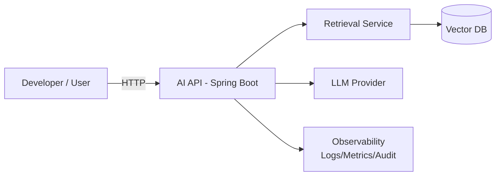

# Architecture — AI Dev Assistant (Enterprise-ready)

## Goal
Build a Spring Boot AI service that helps backend developers by answering questions using internal documentation (RAG) while respecting enterprise constraints (bank/insurance).

## Core use cases
1. Ask a technical question and get a contextual answer based on internal docs
2. Provide citations (which docs/chunks were used)
3. Audit every interaction (prompt/response/model/version/docs)
4. Control cost (limits/caching)
5. Secure data (no secrets/PII leakage)

## High-level components

### 1) Client
- CLI or simple UI
- Calls the AI API

### 2) AI API (Spring Boot)
Responsibilities:
- Auth (later)
- request validation
- orchestration (retrieve context -> call LLM -> return response)
- audit + metrics

### 3) Retrieval (RAG)
Responsibilities:
- chunk documents
- compute embeddings
- store vectors in vector DB
- retrieve top-k relevant chunks for each query

### 4) Vector store
Options (to decide later via ADR):
- Elasticsearch (vector search)
- Postgres + pgvector
- Dedicated vector DB

### 5) LLM Provider
Start:
- OpenAI-compatible API

Later:
- Azure OpenAI (typical in banks)
- local model (Mistral/Llama) depending on constraints

### 6) Observability
- logs (structured)
- metrics (latency, tokens/cost, errors)
- tracing (later)

## Data flow — Ask (RAG)
1. Client sends question to AI API
2. AI API calls Retrieval to fetch top-k chunks
3. AI API builds a prompt:
    - system policy (bank-style constraints)
    - retrieved context
    - user question
4. AI API calls LLM provider
5. AI API returns:
    - answer
    - citations (doc ids, chunk ids)
    - model/version
    - timings (later)
    - cost estimate (later)

## Non-functional requirements (enterprise)
- No secrets in prompts
- PII redaction / safe prompting
- Audit trail for each request
- Rate limiting + token budgets
- Fallback strategy if provider is down
- Config driven (switch provider without refactor)

## Milestones
- M1: Docs + architecture + first API contract (no provider yet)
- M2: Minimal LLM call (hello world)
- M3: RAG MVP with citations
- M4: Production hardening (audit/cost/security/monitoring)

## Diagram (Mermaid)

